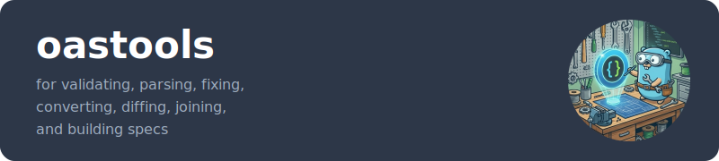

<p align="center">
  
</p>

A complete, self-contained OpenAPI toolkit for Go with minimal dependencies.

[](https://github.com/erraggy/oastools/actions/workflows/go.yml)
[](https://github.com/erraggy/oastools/actions/workflows/golangci-lint.yml)
[](https://goreportcard.com/report/github.com/erraggy/oastools)
[](https://codecov.io/gh/erraggy/oastools)
[](https://pkg.go.dev/github.com/erraggy/oastools)
[](https://opensource.org/licenses/MIT)
[](https://oastools.robnrob.com)

**Parse, validate, fix, convert, diff, join, generate, and build OpenAPI specs (2.0-3.2.0) with zero runtime dependencies beyond YAML for parsing, x/tools for generating, and x/text for title casing.**

## Highlights

- **Minimal Dependencies** - Only [`go.yaml.in/yaml`](https://pkg.go.dev/go.yaml.in/yaml/v4), [`golang.org/x/tools`](https://pkg.go.dev/golang.org/x/tools), and [`golang.org/x/text`](https://pkg.go.dev/golang.org/x/text) at runtime
- **Battle-Tested** - 7,300+ tests against 10 production APIs (Discord, Stripe, GitHub, MS Graph 34MB)
- **Complete Toolset** - 12 packages covering the full OpenAPI lifecycle
- **Performance Optimized** - 140+ benchmarks; pre-parsed workflows 9-150x faster
- **Type-Safe Cloning** - Generated `DeepCopy()` methods preserve types across OAS versions (no JSON marshal hacks)
- **Enterprise Ready** - Structured errors with `errors.Is()`/`errors.As()`, pluggable logging, configurable resource limits
- **Well Documented** - Every package has godoc, runnable examples, and [deep dive guides](#deep-dive-guides) for advanced usage
- **Semantic Deduplication** - Automatically consolidate structurally identical schemas, reducing document size

## Package Ecosystem

| Package | Description | Try |
|---------|-------------|:---:|
| [parser](https://pkg.go.dev/github.com/erraggy/oastools/parser) | Parse & analyze OAS files from files, URLs, or readers | |
| [validator](https://pkg.go.dev/github.com/erraggy/oastools/validator) | Validate specs with structural & semantic checks | [🌐](https://oastools.robnrob.com/validate) |
| [fixer](https://pkg.go.dev/github.com/erraggy/oastools/fixer) | Auto-fix common validation errors | [🌐](https://oastools.robnrob.com/fix) |
| [httpvalidator](https://pkg.go.dev/github.com/erraggy/oastools/httpvalidator) | Validate HTTP requests/responses against OAS at runtime | |
| [converter](https://pkg.go.dev/github.com/erraggy/oastools/converter) | Convert between OAS 2.0 and 3.x | [🌐](https://oastools.robnrob.com/convert) |
| [joiner](https://pkg.go.dev/github.com/erraggy/oastools/joiner) | Merge multiple OAS documents with schema deduplication and operation-aware renaming | [🌐](https://oastools.robnrob.com/join) |
| [overlay](https://pkg.go.dev/github.com/erraggy/oastools/overlay) | Apply OpenAPI Overlay v1.0.0 with JSONPath targeting | [🌐](https://oastools.robnrob.com/overlay) |
| [differ](https://pkg.go.dev/github.com/erraggy/oastools/differ) | Detect breaking changes between versions | [🌐](https://oastools.robnrob.com/diff) |
| [generator](https://pkg.go.dev/github.com/erraggy/oastools/generator) | Generate Go client/server code with security support | |
| [builder](https://pkg.go.dev/github.com/erraggy/oastools/builder) | Programmatically construct OAS documents with deduplication | |
| [walker](https://pkg.go.dev/github.com/erraggy/oastools/walker) | Traverse OAS documents with typed handlers and flow control | |
| [oaserrors](https://pkg.go.dev/github.com/erraggy/oastools/oaserrors) | Structured error types for programmatic handling | |

All packages include comprehensive documentation with runnable examples. See individual package pages on [pkg.go.dev](https://pkg.go.dev/github.com/erraggy/oastools) for API details.

## Deep Dive Guides

For comprehensive examples and advanced usage patterns:

| Package | Deep Dive |
|---------|-----------|
| builder | [Programmatic API Construction](builder/deep_dive.md) |
| converter | [Version Conversion](converter/deep_dive.md) |
| differ | [Breaking Change Detection](differ/deep_dive.md) |
| fixer | [Automatic Fixes](fixer/deep_dive.md) |
| generator | [Code Generation (Client/Server/Types)](generator/deep_dive.md) |
| httpvalidator | [HTTP Request/Response Validation](httpvalidator/deep_dive.md) |
| joiner | [Multi-Document Merging](joiner/deep_dive.md) |
| overlay | [Overlay Transformations](overlay/deep_dive.md) |
| parser | [Parsing & Reference Resolution](parser/deep_dive.md) |
| validator | [Specification Validation](validator/deep_dive.md) |
| walker | [Document Traversal](walker/deep_dive.md) |

## Examples

The [`examples/`](examples/) directory contains complete, runnable examples demonstrating the full oastools ecosystem.

| Category | Examples | Time |
|----------|----------|------|
| **Getting Started** | [quickstart](examples/quickstart/), [validation-pipeline](examples/validation-pipeline/) | 2-5 min |
| **Workflows** | [validate-and-fix](examples/workflows/validate-and-fix/), [version-conversion](examples/workflows/version-conversion/), [multi-api-merge](examples/workflows/multi-api-merge/), [breaking-change-detection](examples/workflows/breaking-change-detection/), [overlay-transformations](examples/workflows/overlay-transformations/), [http-validation](examples/workflows/http-validation/) | 3-5 min each |
| **Programmatic API** | [builder](examples/programmatic-api/builder/) with ServerBuilder | 5 min |
| **Code Generation** | [petstore](examples/petstore/) (stdlib & chi router variants) | 10 min |

Each example is a standalone Go module with its own README, covering all 12 public packages in the ecosystem. See [`examples/README.md`](examples/README.md) for the full feature matrix.

## Installation

### CLI Tool

```bash
# Homebrew (macOS and Linux)
brew tap erraggy/oastools && brew install oastools

# Go install
go install github.com/erraggy/oastools/cmd/oastools@latest
```

Pre-built binaries for macOS, Linux, and Windows are available on the [Releases](https://github.com/erraggy/oastools/releases/latest) page.

### Go Library

```bash
go get github.com/erraggy/oastools@latest
```

Requires Go 1.24 or higher.

## Try it Online

No installation required! Use oastools directly in your browser:

🌐 **[oastools.robnrob.com](https://oastools.robnrob.com)** — Validate, convert, diff, fix, join, and apply overlays without installing anything.

## Quick Start

### CLI

```bash
# Validate a spec (from file or URL)
oastools validate openapi.yaml
oastools validate https://example.com/api/openapi.yaml

# Convert between versions
oastools convert -t 3.0.3 swagger.yaml -o openapi.yaml

# Compare specs and detect breaking changes
oastools diff --breaking api-v1.yaml api-v2.yaml

# Fix common validation errors
oastools fix api.yaml -o fixed.yaml

# Generate Go client/server code
oastools generate --client --server -o ./generated -p api openapi.yaml

# Generate client with full OAuth2 support
oastools generate --client --oauth2-flows --readme -o ./client -p api openapi.yaml

# Generate server with router, validation middleware, and request binding
oastools generate --server --server-all -o ./server -p api openapi.yaml

# Merge multiple specs
oastools join -o merged.yaml base.yaml extensions.yaml

# Apply overlays for environment-specific customizations
oastools overlay apply -s openapi.yaml production.yaml -o production-api.yaml

# Validate an overlay document
oastools overlay validate changes.yaml

# Pipeline support
cat swagger.yaml | oastools convert -q -t 3.0.3 - > openapi.yaml
oastools validate --format json openapi.yaml | jq '.valid'
```

### Library

```go
import (
    "github.com/erraggy/oastools/parser"
    "github.com/erraggy/oastools/validator"
    "github.com/erraggy/oastools/httpvalidator"
    "github.com/erraggy/oastools/differ"
    "github.com/erraggy/oastools/overlay"
    "github.com/erraggy/oastools/generator"
    "github.com/erraggy/oastools/builder"
)

// Parse
result, _ := parser.ParseWithOptions(parser.WithFilePath("api.yaml"))

// Validate specification
vResult, _ := validator.ValidateWithOptions(validator.WithFilePath("api.yaml"))

// Validate HTTP request/response at runtime
hvResult, _ := httpvalidator.ValidateRequestWithOptions(
    req,
    httpvalidator.WithFilePath("api.yaml"),
    httpvalidator.WithStrictMode(true),
)

// Diff
dResult, _ := differ.DiffWithOptions(
    differ.WithSourceFilePath("v1.yaml"),
    differ.WithTargetFilePath("v2.yaml"),
)

// Overlay with dry-run preview
oResult, _ := overlay.DryRunWithOptions(
    overlay.WithSpecFilePath("api.yaml"),
    overlay.WithOverlayFilePath("changes.yaml"),
)

// Generate Go client code
gResult, _ := generator.GenerateWithOptions(
    generator.WithFilePath("api.yaml"),
    generator.WithPackageName("api"),
    generator.WithClient(true),
)

// Build a spec programmatically
spec := builder.New(parser.OASVersion300).
    SetTitle("My API").
    SetVersion("1.0.0").
    AddServer("https://api.example.com", "Production")
doc, _ := spec.BuildOAS3()
```

For complete API documentation and examples, see [pkg.go.dev](https://pkg.go.dev/github.com/erraggy/oastools) or the [Developer Guide](docs/developer-guide.md).

## Why oastools?

### Minimal Dependencies

```
github.com/erraggy/oastools
├── go.yaml.in/yaml/v4  (YAML parsing)
└── golang.org/x/tools  (Code generation - imports analysis)
```

Unlike many OpenAPI tools that pull in dozens of transitive dependencies, oastools is designed to be self-contained. The `stretchr/testify` dependency is test-only and not included in your production builds.

### Battle-Tested Quality

The entire toolchain is validated against a corpus of 10 real-world production APIs:

| Domain          | APIs                                    |
|-----------------|-----------------------------------------|
| FinTech         | Stripe, Plaid                           |
| Developer Tools | GitHub, DigitalOcean                    |
| Communications  | Discord (OAS 3.1)                       |
| Enterprise      | Microsoft Graph (34MB, 18k+ operations) |
| Location        | Google Maps                             |
| Public          | US National Weather Service             |
| Reference       | Petstore (OAS 2.0)                      |
| Productivity    | Asana                                   |

This corpus spans OAS 2.0 through 3.1, JSON and YAML formats, and document sizes from 20KB to 34MB.

### Performance

Pre-parsed workflows eliminate redundant parsing when processing multiple operations:

| Method             | Speedup      |
|--------------------|--------------|
| `ValidateParsed()` | 31x faster   |
| `ConvertParsed()`  | 9x faster    |
| `JoinParsed()`     | 150x faster  |
| `DiffParsed()`     | 81x faster   |
| `FixParsed()`      | ~10x faster  |
| `ApplyParsed()`    | ~15x faster  |

JSON marshaling is optimized for 25-32% better performance with 29-37% fewer allocations. See [benchmarks.md](benchmarks.md) for detailed analysis.

### Type-Safe Document Cloning

All parser types include generated `DeepCopy()` methods for safe document mutation. Unlike JSON marshal/unmarshal approaches used by other tools, oastools provides:

- **Type preservation** - Polymorphic fields maintain their actual types (e.g., `Schema.Type` as `string` vs `[]string` for OAS 3.1)
- **Version-aware copying** - Handles OAS version differences correctly (`ExclusiveMinimum` as bool in 3.0 vs number in 3.1)
- **Extension preservation** - All `x-*` extension fields are deep copied
- **Performance** - Direct struct copying without serialization overhead

```go
// Safe mutation without affecting the original
copy := result.OAS3Document.DeepCopy()
copy.Info.Title = "Modified API"
```

### Enterprise-Grade Error Handling

The `oaserrors` package provides structured error types that work with Go's standard `errors.Is()` and `errors.As()`:

```go
import (
    "errors"
    "github.com/erraggy/oastools/oaserrors"
    "github.com/erraggy/oastools/parser"
)

result, err := parser.ParseWithOptions(parser.WithFilePath("api.yaml"))
if err != nil {
    // Check error category with errors.Is()
    if errors.Is(err, oaserrors.ErrPathTraversal) {
        log.Fatal("Security: path traversal attempt blocked")
    }

    // Extract details with errors.As()
    var refErr *oaserrors.ReferenceError
    if errors.As(err, &refErr) {
        log.Printf("Failed to resolve: %s (type: %s)", refErr.Ref, refErr.RefType)
    }
}
```

Error types include `ParseError`, `ReferenceError`, `ValidationError`, `ResourceLimitError`, `ConversionError`, and `ConfigError`.

### Configurable Resource Limits

Protect against resource exhaustion with configurable limits:

```go
result, err := parser.ParseWithOptions(
    parser.WithFilePath("api.yaml"),
    parser.WithMaxRefDepth(50),           // Max $ref nesting (default: 100)
    parser.WithMaxCachedDocuments(200),   // Max cached external docs (default: 100)
    parser.WithMaxFileSize(20*1024*1024), // Max file size in bytes (default: 10MB)
)
```

## Supported OpenAPI Versions

| Version       | Specification                                     |
|---------------|---------------------------------------------------|
| 2.0 (Swagger) | [spec](https://spec.openapis.org/oas/v2.0.html)   |
| 3.0.0 - 3.0.4 | [spec](https://spec.openapis.org/oas/v3.0.4.html) |
| 3.1.0 - 3.1.2 | [spec](https://spec.openapis.org/oas/v3.1.2.html) |
| 3.2.0         | [spec](https://spec.openapis.org/oas/v3.2.0.html) |

**Features:**
- Automatic format detection and preservation (JSON/YAML)
- External reference resolution (local files; HTTP with opt-in flag)
- JSON Pointer array index support (`#/paths/~1users/get/parameters/0`)
- Full JSON Schema Draft 2020-12 compliance for OAS 3.1+ (including `unevaluatedProperties`, `unevaluatedItems`, content keywords)
- Path traversal protection for security

## Documentation

📄 **[White Paper](https://erraggy.github.io/oastools/whitepaper/)** - Comprehensive technical exploration of oastools architecture and design

📚 **[Developer Guide](docs/developer-guide.md)** - Complete library usage with examples for all 12 public packages

📖 **[CLI Reference](docs/cli-reference.md)** - Full command documentation with all flags, options, and output formats

| Resource                                                     | Description                             |
|--------------------------------------------------------------|-----------------------------------------|
| [pkg.go.dev](https://pkg.go.dev/github.com/erraggy/oastools) | API reference with runnable examples    |
| [Breaking Changes Guide](docs/breaking-changes.md)           | Understanding breaking change detection |
| [Benchmarks](benchmarks.md)                                  | Detailed performance analysis           |

## Development

```bash
make check  # Run all quality checks (tidy, fmt, lint, test)
make test   # Run tests with coverage
make build  # Build CLI binary
```

### Documentation

```bash
make docs-serve  # Preview docs locally at http://127.0.0.1:8000/oastools/
make docs-build  # Build static site to site/
```

The documentation site is automatically deployed to [GitHub Pages](https://erraggy.github.io/oastools/) on every push to `main`.

See [WORKFLOW.md](https://github.com/erraggy/oastools/blob/main/WORKFLOW.md) for the complete development process.

## Contributing

1. Fork and create a feature branch
2. Run `make check` before committing
3. Follow [conventional commits](https://conventionalcommits.org) (e.g., `feat(parser): add feature`)
4. Submit a PR with testing checklist

See [WORKFLOW.md](https://github.com/erraggy/oastools/blob/main/WORKFLOW.md) for guidelines and [AGENTS.md](https://github.com/erraggy/oastools/blob/main/AGENTS.md) for AI agent setup.

## License

MIT

_All code generated by Claude Code using claude-4-5-sonnet/opus with minor edits and full control by [@erraggy](https://github.com/erraggy)_
