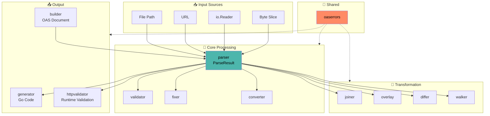

# oastools: A Comprehensive OpenAPI Toolkit for Go

**White Paper**

**Current as of:** v1.46.2<br>
**Repository:** [github.com/erraggy/oastools](https://github.com/erraggy/oastools)<br>
**Documentation:** [pkg.go.dev/github.com/erraggy/oastools](https://pkg.go.dev/github.com/erraggy/oastools)<br>
**License:** MIT

---

## Executive Summary

oastools is a comprehensive, high-performance toolkit for working with [OpenAPI Specification](https://spec.openapis.org/) (OAS) documents in Go. It provides a complete solution for parsing, validating, fixing, converting, joining, diffing, and generating code from API specifications spanning [OAS 2.0](https://spec.openapis.org/oas/v2.0.html) (Swagger) through [OAS 3.2.0](https://spec.openapis.org/oas/v3.2.0.html). The toolkit distinguishes itself through minimal dependencies, battle-tested quality against production APIs, significant performance optimizations, and native support for the [OpenAPI Overlay Specification v1.0.0](https://spec.openapis.org/overlay/v1.0.0.html).

This white paper provides an in-depth exploration of oastools, covering its architecture, package ecosystem, integration with external specifications, real-world validation, and practical usage patterns. It serves as both a technical reference and an evaluation guide for teams considering adoption.

---

## Table of Contents

1. [Introduction and Motivation](#1-introduction-and-motivation)
2. [External Specification Compliance](#2-external-specification-compliance)
3. [Package Architecture](#3-package-architecture)
4. [Parser Package](#4-parser-package)
5. [Validator Package](#5-validator-package)
6. [Fixer Package](#6-fixer-package)
7. [Converter Package](#7-converter-package)
8. [Joiner Package](#8-joiner-package)
9. [Overlay Package](#9-overlay-package)
10. [Differ Package](#10-differ-package)
11. [Generator Package](#11-generator-package)
12. [Builder Package](#12-builder-package)
13. [HTTP Validator Package](#13-http-validator-package)
14. [Walker Package](#14-walker-package)
15. [Error Handling with oaserrors](#15-error-handling-with-oaserrors)
16. [Performance Analysis](#16-performance-analysis)
17. [Real-World Validation](#17-real-world-validation)
18. [CLI Reference](#18-cli-reference)
19. [API Design Patterns](#19-api-design-patterns)
20. [Security Considerations](#20-security-considerations)
21. [Conclusion](#21-conclusion)
22. [References](#22-references)

---

## 1. Introduction and Motivation

The [OpenAPI Specification](https://spec.openapis.org/) has become the de facto standard for describing HTTP APIs. As organizations adopt API-first development practices, the need for robust tooling to parse, validate, transform, and generate code from OpenAPI documents has grown significantly. The Go ecosystem, while rich in many areas, has historically lacked comprehensive OpenAPI tooling that addresses enterprise-scale requirements.

oastools was created to fill this gap, addressing several key pain points. First, existing Go libraries often lack support for newer OAS versions, particularly [OAS 3.1.x](https://spec.openapis.org/oas/v3.1.0.html) with its [JSON Schema 2020-12](https://json-schema.org/draft/2020-12/json-schema-core.html) alignment, and the recently released [OAS 3.2.0](https://spec.openapis.org/oas/v3.2.0.html) with streaming and QUERY method support. Second, many OpenAPI tools bring extensive dependency trees, complicating builds, increasing binary sizes, and introducing potential security vulnerabilities. Third, repeatedly parsing the same document across validation, conversion, and generation pipelines creates unnecessary overhead at scale. Finally, generating idiomatic Go code that properly handles [OAuth2](https://datatracker.ietf.org/doc/html/rfc6749) flows, Proof Key for Code Exchange ([PKCE](https://datatracker.ietf.org/doc/html/rfc7636)), and OpenID Connect (OIDC) discovery remains challenging with existing tools.

oastools addresses these challenges through a modular twelve-package architecture, each package designed to excel at a specific task while integrating seamlessly with others. The toolkit emphasizes correctness, performance, and developer experience.

### Design Philosophy

The development of oastools follows several guiding principles. The toolkit maintains minimal dependencies, relying only on `go.yaml.in/yaml/v4` for YAML parsing, `golang.org/x/text` for Unicode handling, and `golang.org/x/tools` for import analysis during code generation. The parse-once pattern ensures documents flow through multiple operations without redundant parsing. All [parser](#4-parser-package) types include generated `DeepCopy()` methods for safe document mutation without serialization overhead. The toolkit supports [OAS 2.0](https://spec.openapis.org/oas/v2.0.html) through [OAS 3.2.0](https://spec.openapis.org/oas/v3.2.0.html) comprehensively, adapting behavior for version-specific features. Both functional options for one-off operations and reusable struct instances for batch processing are supported.

### Practical Examples

For hands-on examples demonstrating oastools capabilities, see the [examples directory](https://github.com/erraggy/oastools/tree/main/examples) in the repository. The Petstore example showcases a complete workflow including parsing, validation, code generation, and server implementation.

---

## 2. External Specification Compliance

oastools implements and integrates with several external specifications. Understanding these relationships is essential for evaluating the toolkit's capabilities and limitations.

### 2.1 OpenAPI Specification

The [OpenAPI Specification](https://www.openapis.org/) (OAS) defines a standard, programming language-agnostic interface description for HTTP APIs. oastools supports the complete OAS version range as specified by the [OpenAPI Initiative](https://www.openapis.org/).

**Supported Versions:**

| Version | Specification URL | Key Features |
|---------|-------------------|--------------|
| OAS 2.0 | [spec.openapis.org/oas/v2.0.html](https://spec.openapis.org/oas/v2.0.html) | Swagger foundation, `definitions`, `host`/`basePath` |
| OAS 3.0.0 | [spec.openapis.org/oas/v3.0.0.html](https://spec.openapis.org/oas/v3.0.0.html) | `requestBody`, `servers[]`, `components` |
| OAS 3.0.1 | [spec.openapis.org/oas/v3.0.1.html](https://spec.openapis.org/oas/v3.0.1.html) | Clarifications to 3.0.0 |
| OAS 3.0.2 | [spec.openapis.org/oas/v3.0.2.html](https://spec.openapis.org/oas/v3.0.2.html) | Additional clarifications |
| OAS 3.0.3 | [spec.openapis.org/oas/v3.0.3.html](https://spec.openapis.org/oas/v3.0.3.html) | Bug fixes, clarifications |
| OAS 3.0.4 | [spec.openapis.org/oas/v3.0.4.html](https://spec.openapis.org/oas/v3.0.4.html) | Latest 3.0.x patch release |
| OAS 3.1.0 | [spec.openapis.org/oas/v3.1.0.html](https://spec.openapis.org/oas/v3.1.0.html) | JSON Schema 2020-12 alignment, webhooks |
| OAS 3.1.1 | [spec.openapis.org/oas/v3.1.1.html](https://spec.openapis.org/oas/v3.1.1.html) | Clarifications to 3.1.0 |
| OAS 3.1.2 | [spec.openapis.org/oas/v3.1.2.html](https://spec.openapis.org/oas/v3.1.2.html) | Latest 3.1.x patch release |
| OAS 3.2.0 | [spec.openapis.org/oas/v3.2.0.html](https://spec.openapis.org/oas/v3.2.0.html) | QUERY method, streaming media types, tag hierarchies |

**OAS 3.1.x JSON Schema Alignment:**

[OAS 3.1.x](https://spec.openapis.org/oas/v3.1.0.html) introduced significant changes by aligning with [JSON Schema Draft 2020-12](https://json-schema.org/draft/2020-12/json-schema-core.html). Key differences that oastools handles include polymorphic `type` fields (string or array), nullable representation (type arrays including `"null"` rather than `nullable: true`), `exclusiveMinimum`/`exclusiveMaximum` as numbers rather than booleans, and new keywords like `unevaluatedProperties`, `unevaluatedItems`, `contentEncoding`, `contentMediaType`, and `contentSchema`.

**OAS 3.2.0 Features:**

The latest [OAS version](https://spec.openapis.org/oas/v3.2.0.html) introduces several capabilities that oastools fully supports: the `$self` URI fragment for self-references, the QUERY HTTP method for complex queries, `additionalOperations` for custom HTTP methods, `pathItems` reusability via components, streaming media types (`application/jsonl`, `text/event-stream`), and tag hierarchies with `parent` and `kind` fields.

### 2.2 OpenAPI Overlay Specification

The [Overlay Specification v1.0.0](https://spec.openapis.org/overlay/v1.0.0.html) defines a document format for transforming OpenAPI descriptions while remaining separate from the source documents. oastools provides native overlay support through its dedicated [overlay package](#9-overlay-package).

The specification defines an overlay document structure with a required `overlay` version field, `info` metadata, an optional `extends` URL pointing to the target OpenAPI document, and an `actions` array containing transformation instructions.

**Action Types:**

The `update` action merges objects and appends to arrays at the target location. When targeting an object, properties are merged with overlay values taking precedence. When targeting an array, the update value is appended.

The `remove` action deletes nodes at the target location. When set to `true`, the matched nodes are removed from the document.

**JSONPath Implementation:**

oastools implements [JSONPath per RFC 9535](https://datatracker.ietf.org/doc/html/rfc9535) for targeting nodes within OpenAPI documents. Supported features include root navigation (`$`), child access (dot and bracket notation), wildcards (`*` for all children), array indices (positive and negative), array slices (`[start:end:step]`), recursive descent (`..`), simple filter expressions (`[?(@.property == value)]`), compound filters with logical operators, and comparison operators (`==`, `!=`, `<`, `>`, `<=`, `>=`).

### 2.3 Go Language Specification

oastools targets [Go 1.24+](https://go.dev/doc/go1.24) and leverages language features accordingly. The toolkit uses generics for type-safe operations where appropriate, Go 1.24 benchmark patterns with `b.Loop()` for accurate performance measurement, and standard library patterns for HTTP handling that integrate with `net/http`. The [generator package](#11-generator-package) produces code compatible with Go 1.18+ when using generics for optional types.

### 2.4 Related RFCs

The toolkit implements or references several IETF RFCs. [RFC 9535](https://datatracker.ietf.org/doc/html/rfc9535) (JSONPath) provides the query language for [overlay](#9-overlay-package) targeting. [RFC 7636](https://datatracker.ietf.org/doc/html/rfc7636) (PKCE) is implemented in OAuth2 code generation for secure authorization flows. [RFC 6749](https://datatracker.ietf.org/doc/html/rfc6749) (OAuth 2.0) is the foundation for security scheme code generation. [RFC 3986](https://datatracker.ietf.org/doc/html/rfc3986) (URIs) governs reference resolution and URL handling. [RFC 6570](https://datatracker.ietf.org/doc/html/rfc6570) (URI Templates) underlies path parameter serialization.

---

## 3. Package Architecture

oastools comprises twelve public packages, each with a focused responsibility and clear integration points.

```
oastools/
├── parser/         # Parse OAS documents from files, URLs, readers, or bytes
├── validator/      # Validate documents against their declared OAS version
├── fixer/          # Automatically fix common validation errors
├── httpvalidator/  # Runtime HTTP request/response validation
├── converter/      # Convert between OAS versions (2.0 ↔ 3.x)
├── joiner/         # Merge multiple OAS documents with collision handling
├── overlay/        # Apply OpenAPI Overlay transformations
├── differ/         # Compare documents, detect breaking changes
├── generator/      # Generate Go client/server code with security support
├── builder/        # Programmatically construct OAS documents
├── walker/         # Traverse OAS documents with typed handlers and flow control
├── oaserrors/      # Structured error types for programmatic handling
└── internal/       # Internal utilities (not public API)
    ├── httputil/   # HTTP constants and validation
    ├── severity/   # Issue severity levels
    ├── issues/     # Unified issue reporting
    ├── schemautil/ # Schema utilities
    ├── jsonpath/   # JSONPath RFC 9535 implementation
    ├── corpusutil/ # Test corpus management
    └── testutil/   # Test helpers
```

### Package Relationships



The packages form a coherent processing pipeline. The [parser](#4-parser-package) sits at the foundation, providing `ParseResult` structures consumed by all other packages. The [validator](#5-validator-package) depends on parser output for structural and semantic validation. The [fixer](#6-fixer-package) uses parser output and can optionally leverage validator feedback for targeted fixes. The [converter](#7-converter-package) transforms parser output between OAS versions. The [joiner](#8-joiner-package) combines multiple `ParseResult` instances into a unified document. The [overlay](#9-overlay-package) applies transformations to parser output using [JSONPath](https://datatracker.ietf.org/doc/html/rfc9535) targeting. The [differ](#10-differ-package) compares two `ParseResult` instances to detect changes. The [walker](#14-walker-package) traverses parser output with typed handlers for analysis, mutation, and filtering. The [generator](#11-generator-package) produces Go code from parser output. The [builder](#12-builder-package) constructs documents programmatically, producing output compatible with parser structures. The [httpvalidator](#13-http-validator-package) uses parser output to validate runtime HTTP traffic. The [oaserrors](#15-error-handling-with-oaserrors) package provides error types used throughout all other packages.

### Format Preservation

A critical feature is format preservation across the pipeline. The [parser](#4-parser-package) detects source format (JSON or YAML) from file extension or content inspection and stores it in `ParseResult.SourceFormat`. This format flows through [converter](#7-converter-package), [joiner](#8-joiner-package), and [fixer](#6-fixer-package) operations, ensuring output matches input format. When joining multiple documents, the first document's format determines output format.

---

## Package Chaining

oastools packages are designed for seamless composition. Each package's result type provides a `ToParseResult()` method, enabling fluid pipelines without manual rewrapping:

```go
result, _ := parser.Parse("spec.yaml", false, true)

// Chain through the entire toolchain without losing context
validated := validator.ValidateParsed(result, true, false)
fixed := fixer.FixParsed(validated.ToParseResult())
converted := converter.ConvertParsed(fixed.ToParseResult(), "3.1.0")
joined := joiner.JoinParsed(converted.ToParseResult(), other.ToParseResult())
```

| Package | Result Type | Provides ToParseResult() |
|---------|-------------|-------------------------|
| validator | `ValidationResult` | v1.41.0 |
| fixer | `FixResult` | v1.41.0 |
| converter | `ConvertResult` | v1.40.0 |
| joiner | `JoinResult` | v1.40.0 |

This pattern eliminates boilerplate and preserves metadata (source path, OAS version, parse options) throughout the pipeline.

---

## 4. Parser Package

> **Links:** [pkg.go.dev](https://pkg.go.dev/github.com/erraggy/oastools/parser) | [Deep Dive](packages/parser.md)

The parser package forms the foundation of oastools, providing comprehensive parsing for OpenAPI documents across all supported versions.

### 4.1 Core Capabilities

The parser offers automatic version detection by examining the `openapi` or `swagger` field to determine version and select appropriate parsing strategy. It supports format detection through file extension inspection, content analysis (JSON starts with `{` or `[`), and falls back to YAML when uncertain. Multiple input sources are supported, including local file paths, remote URLs (with security controls), `io.Reader` implementations, and raw byte slices.

### 4.2 Reference Resolution

Reference handling is central to OpenAPI processing. The parser supports three reference types with distinct security profiles.

Local references (`#/components/schemas/User`) point within the same document and are always resolved. File references (`./common.yaml#/schemas/Error`) point to external files and are resolved with path traversal protection. HTTP references (`https://example.com/schemas.yaml`) point to remote URLs and require explicit opt-in via `WithResolveHTTPRefs(true)`.

**Circular Reference Handling:**

When circular references are detected, the `$ref` node remains unresolved (preserving the original reference), a warning is added to `result.Warnings`, and the document remains valid for most operations. Detection triggers when a `$ref` points to an ancestor in the resolution path or when resolution depth exceeds `MaxRefDepth`.

### 4.3 Resource Limits

Configurable limits protect against resource exhaustion attacks.

| Limit | Default | Description |
|-------|---------|-------------|
| `MaxRefDepth` | 100 | Maximum nested `$ref` resolution depth |
| `MaxCachedDocuments` | 100 | Maximum external documents to cache |
| `MaxFileSize` | 10MB | Maximum file size for external references |

### 4.4 API Usage

**Functional Options Pattern:**

```go
result, err := parser.ParseWithOptions(
    parser.WithFilePath("api.yaml"),
    parser.WithResolveRefs(true),
    parser.WithSourceMap(true),
)
if err != nil {
    log.Fatal(err)
}
fmt.Printf("Parsed %s, version %s\n", result.FilePath, result.Version)
```

**Struct-Based Pattern:**

```go
p := parser.New()
p.ResolveRefs = true
p.ValidateStructure = true

result1, _ := p.Parse("api1.yaml")
result2, _ := p.Parse("api2.yaml")
```

### 4.5 ParseResult Structure

The `ParseResult` type contains all parsed information.

```go
type ParseResult struct {
    // Document contains the parsed document (version-specific type)
    Document any
    
    // Version-specific accessors (methods, not fields)
    // doc2, ok := result.OAS2Document()  // Returns (*OAS2Document, bool)
    // doc3, ok := result.OAS3Document()  // Returns (*OAS3Document, bool)
    
    // Metadata
    Version      OASVersion     // Detected version (e.g., "3.1.0")
    FilePath     string         // Source file path
    SourceFormat SourceFormat   // JSON or YAML
    
    // Optional features
    SourceMap    *SourceMap     // Line/column mapping (if enabled)
    Warnings     []string       // Non-fatal warnings
}
```

### 4.6 Type-Safe Cloning

All parser types include generated `DeepCopy()` methods for safe mutation.

```go
original := result.OAS3Document
copy := original.DeepCopy()
copy.Info.Title = "Modified API"
// original.Info.Title unchanged
```

Unlike JSON marshal/unmarshal approaches, `DeepCopy()` preserves type information for polymorphic fields like `Schema.Type` (which may be `string` or `[]string` in [OAS 3.1+](https://spec.openapis.org/oas/v3.1.0.html)), version-specific semantics such as `ExclusiveMinimum` representation, and all `x-*` extension fields.

### 4.7 DocumentAccessor Interface

The `DocumentAccessor` interface provides version-agnostic access to common document fields across [OAS 2.0](https://spec.openapis.org/oas/v2.0.html) and [OAS 3.x](https://spec.openapis.org/oas/v3.0.0.html) documents, eliminating the need for version-specific type switches.

```go
result, _ := parser.ParseWithOptions(parser.WithFilePath("api.yaml"))
accessor := result.AsAccessor()

// Works identically for OAS 2.0 and 3.x
for path := range accessor.GetPaths() {
    fmt.Println("Path:", path)
}
for name := range accessor.GetSchemas() {
    fmt.Println("Schema:", name)
}
fmt.Println("Ref prefix:", accessor.SchemaRefPrefix())
```

**Available Methods:**

| Method | OAS 2.0 Source | OAS 3.x Source |
|--------|---------------|----------------|
| `GetInfo()` | `doc.Info` | `doc.Info` |
| `GetPaths()` | `doc.Paths` | `doc.Paths` |
| `GetSchemas()` | `doc.Definitions` | `doc.Components.Schemas` |
| `GetSecuritySchemes()` | `doc.SecurityDefinitions` | `doc.Components.SecuritySchemes` |
| `GetParameters()` | `doc.Parameters` | `doc.Components.Parameters` |
| `GetResponses()` | `doc.Responses` | `doc.Components.Responses` |
| `GetVersion()` | `doc.OASVersion` | `doc.OASVersion` |
| `SchemaRefPrefix()` | `#/definitions/` | `#/components/schemas/` |

This abstraction is particularly useful for tooling that needs to operate on documents regardless of their OAS version.

### Structural Comparison

All OAS types provide `Equals()` methods for deep structural comparison:

```go
if doc1.Equals(doc2) {
    fmt.Println("Documents are structurally identical")
}
```

This is useful for detecting changes, caching decisions, and test assertions.

### Deterministic Output

The `MarshalOrderedJSON()` and `MarshalOrderedYAML()` functions produce deterministic output by preserving key order. This ensures:
- Reproducible diffs between versions
- Consistent output for CI/CD pipelines
- Predictable test snapshots

---

## 5. Validator Package

> **Links:** [pkg.go.dev](https://pkg.go.dev/github.com/erraggy/oastools/validator) | [Deep Dive](packages/validator.md)

The validator package ensures OpenAPI documents conform to their declared specification version, catching structural errors and semantic violations.

### 5.1 Validation Modes

**Structural Validation** verifies required fields are present, types are correct per specification, format constraints are satisfied, and reference targets exist.

**Semantic Validation** ensures operationIds are unique across the document, HTTP status codes are valid, parameter names are unique per location, and security scheme references exist in components.

**Strict Mode** performs additional checks including flagging non-standard HTTP status codes, requiring at least one success response (2xx) per operation, and detecting deprecated feature usage.

### 5.2 API Usage

```go
// Functional options with file path
result, err := validator.ValidateWithOptions(
    validator.WithFilePath("api.yaml"),
    validator.WithStrictMode(true),
)

// Pre-parsed for performance (31x faster)
parsed, _ := parser.ParseWithOptions(parser.WithFilePath("api.yaml"))
result, err := validator.ValidateWithOptions(
    validator.WithParsed(*parsed),
    validator.WithStrictMode(true),
)

if !result.Valid {
    for _, e := range result.Errors {
        fmt.Printf("Error at %s: %s\n", e.Path, e.Message)
    }
}
```

### 5.3 Validation Result

```go
type ValidationResult struct {
    Valid         bool              // Overall validity
    Errors        []ValidationError // Errors (spec violations)
    Warnings      []ValidationError // Warnings (best practice)
    ErrorCount    int
    WarningCount  int
    InfoCount     int
    Version       parser.OASVersion
}

type ValidationError struct {
    Path             string                   // JSON path to error location
    Message          string                   // Human-readable description
    Severity         severity.Level           // Error, Warning, or Info
    SpecRef          string                   // URL to relevant spec section
    Line             int                      // Line number (if source map enabled)
    Column           int                      // Column number (if source map enabled)
    File             string                   // File path (if source map enabled)
    OperationContext *issues.OperationContext // API operation context (v1.46.0+)
}
```

### 5.4 Source Map Integration

When parsing with `WithSourceMap(true)`, validation errors include precise location information.

```go
parsed, _ := parser.ParseWithOptions(
    parser.WithFilePath("api.yaml"),
    parser.WithSourceMap(true),
)
result, _ := validator.ValidateWithOptions(
    validator.WithParsed(*parsed),
)

for _, e := range result.Errors {
    fmt.Printf("%s:%d:%d: %s\n", e.File, e.Line, e.Column, e.Message)
}
```

### 5.5 CLI Integration

The `--validate-structure` CLI flag controls parser validation behavior, enabling strict structural validation during parsing.

### 5.6 Operation Context (v1.46.0+)

Validation errors now include operation context, making it easy to identify which API endpoint triggered each error. The `OperationContext` field provides the HTTP method, path, and operationId.

```go
result, _ := validator.ValidateWithOptions(
    validator.WithParsed(*parsed),
)

for _, e := range result.Errors {
    if e.OperationContext != nil {
        fmt.Printf("%s %s (%s): %s\n",
            e.OperationContext.Method,
            e.OperationContext.Path,
            e.OperationContext.OperationID,
            e.Message)
    }
}
// Output: GET /users/{userId} (getUser): missing path parameter "userId"
```

---

## 6. Fixer Package

> **Links:** [pkg.go.dev](https://pkg.go.dev/github.com/erraggy/oastools/fixer) | [Deep Dive](packages/fixer.md)

The fixer package automatically corrects common validation errors, reducing manual intervention in API specification maintenance.

### 6.1 Supported Fix Types

**Missing Path Parameters (FixTypeMissingPathParameter):** When a path template contains variables like `/users/{userId}` but the operation lacks a corresponding parameter declaration, the fixer adds one. Type inference can be enabled to assign appropriate types based on naming conventions.

**Invalid Schema Names (FixTypeRenamedGenericSchema):** Schemas with names containing URL-encoding-required characters (such as `Response[User]` from code generators) are renamed using configurable strategies. All `$ref` values throughout the document are updated accordingly.

**Unused Schemas (FixTypePrunedUnusedSchema):** Schema definitions not referenced anywhere in the document are removed, cleaning up orphaned definitions.

**Empty Paths (FixTypePrunedEmptyPath):** Path items with no HTTP operations (only parameters or extensions) are removed.

**Missing Reference Targets (FixTypeStubMissingRefs, v1.46.0+):** When a `$ref` points to a non-existent schema or response definition, the fixer creates a stub placeholder to prevent validation errors. Stub descriptions are configurable via `WithStubConfig()` or `WithStubResponseDescription()`.

### 6.2 Default Behavior

For performance, only `FixTypeMissingPathParameter` is enabled by default. Schema renaming and pruning involve expensive operations (walking all references, computing unused schemas) that can significantly slow processing of large specifications.

### 6.3 Type Inference

When enabled, the fixer infers parameter types from naming conventions.

| Pattern | Inferred Type | Format |
|---------|---------------|--------|
| `*id`, `*Id`, `*ID` | integer | - |
| `*uuid`, `*guid` | string | uuid |
| Everything else | string | - |

### 6.4 Generic Naming Strategies

When fixing invalid schema names, several strategies are available.

| Strategy | Example Input | Example Output |
|----------|---------------|----------------|
| `GenericNamingUnderscore` | `Response[User]` | `Response_User_` |
| `GenericNamingOf` | `Response[User]` | `ResponseOfUser` |
| `GenericNamingFor` | `Response[User]` | `ResponseForUser` |
| `GenericNamingFlattened` | `Response[User]` | `ResponseUser` |
| `GenericNamingDot` | `Response[User]` | `Response.User` |

### 6.5 API Usage

```go
// Enable specific fixes
result, err := fixer.FixWithOptions(
    fixer.WithFilePath("api.yaml"),
    fixer.WithEnabledFixes(
        fixer.FixTypeMissingPathParameter,
        fixer.FixTypeRenamedGenericSchema,
        fixer.FixTypePrunedUnusedSchema,
    ),
    fixer.WithInferTypes(true),
    fixer.WithGenericNaming(fixer.GenericNamingOf),
)

fmt.Printf("Applied %d fixes\n", result.FixCount)
for _, fix := range result.Fixes {
    fmt.Printf("  %s at %s\n", fix.Type, fix.Path)
}
```

### 6.6 Duplicate OperationId Detection

The fixer detects duplicate `operationId` values and automatically generates unique replacements, preventing spec validation failures.

### 6.7 CSV Enum Expansion

Enum values specified as comma-separated strings are automatically expanded to proper typed arrays.

---

## 7. Converter Package

> **Links:** [pkg.go.dev](https://pkg.go.dev/github.com/erraggy/oastools/converter) | [Deep Dive](packages/converter.md)

The converter package transforms OpenAPI documents between versions, handling the significant structural differences between [OAS 2.0](https://spec.openapis.org/oas/v2.0.html) and [OAS 3.x](https://spec.openapis.org/oas/v3.0.0.html).

### 7.1 Supported Conversions

| From | To | Notes |
|------|----|-------|
| [OAS 2.0](https://spec.openapis.org/oas/v2.0.html) | [OAS 3.0.x](https://spec.openapis.org/oas/v3.0.0.html) | Full upgrade with structural transformation |
| [OAS 2.0](https://spec.openapis.org/oas/v2.0.html) | [OAS 3.1.x](https://spec.openapis.org/oas/v3.1.0.html) | Includes JSON Schema 2020-12 alignment |
| [OAS 3.x](https://spec.openapis.org/oas/v3.0.0.html) | [OAS 2.0](https://spec.openapis.org/oas/v2.0.html) | Downgrade with potential feature loss |
| [OAS 3.0.x](https://spec.openapis.org/oas/v3.0.0.html) | [OAS 3.1.x](https://spec.openapis.org/oas/v3.1.0.html) | Version update within 3.x family |
| [OAS 3.1.x](https://spec.openapis.org/oas/v3.1.0.html) | [OAS 3.0.x](https://spec.openapis.org/oas/v3.0.0.html) | Version downgrade with schema adjustments |

### 7.2 Key Transformations

**OAS 2.0 → OAS 3.x:**

The conversion handles structural changes between versions. The `host`, `basePath`, and `schemes` fields become the `servers` array. The `consumes`/`produces` fields and `body` parameter combine into `requestBody` with `content` map. The `securityDefinitions` becomes `components/securitySchemes` with restructured [OAuth2](https://datatracker.ietf.org/doc/html/rfc6749) flows. The `definitions` section becomes `components/schemas`.

**OAS 3.x → OAS 2.0:**

Downgrade conversions handle feature reduction. Multiple servers collapse to `host` and `basePath`. The `requestBody` becomes a `body` parameter. Features without [OAS 2.0](https://spec.openapis.org/oas/v2.0.html) equivalents (callbacks, links) generate warnings.

### 7.3 Issue Tracking

Conversions may produce issues at different severity levels.

**Critical:** The conversion cannot be completed accurately, such as when incompatible features block conversion.

**Warning:** Information may be lost, such as when multiple servers are collapsed to one or callbacks are removed.

**Info:** Structural changes were applied, such as when a security scheme was restructured.

### 7.4 API Usage

```go
result, err := converter.ConvertWithOptions(
    converter.WithFilePath("swagger.yaml"),
    converter.WithTargetVersion("3.1.0"),
)

for _, issue := range result.Issues {
    fmt.Printf("[%s] %s: %s\n", issue.Severity, issue.Path, issue.Message)
}
```

---

## 8. Joiner Package

> **Links:** [pkg.go.dev](https://pkg.go.dev/github.com/erraggy/oastools/joiner) | [Deep Dive](packages/joiner.md)

The joiner package merges multiple OpenAPI documents into a single unified specification, handling collisions and maintaining referential integrity.

### 8.1 Collision Strategies

When joining documents, name collisions may occur in schemas, paths, or other components. The joiner provides configurable strategies.

| Strategy | Behavior |
|----------|----------|
| `StrategyFailOnCollision` | Error immediately on any collision (default) |
| `StrategyAcceptLeft` | Keep the first (left) definition |
| `StrategyAcceptRight` | Keep the last (right) definition |
| `StrategyRenameLeft` | Rename conflicting item from left document |
| `StrategyRenameRight` | Rename conflicting item from right document |
| `StrategyDeduplicateEquivalent` | Keep one if structurally identical, error if different |
| `StrategyFailOnPaths` | Error only on path collisions, accept others |

### 8.2 Semantic Deduplication

The `StrategyDeduplicateEquivalent` strategy performs deep structural comparison. Two schemas are considered equivalent if they have identical types, properties, required fields, and constraints. When equivalent schemas are found, one is kept and all references are updated to point to the surviving definition. Empty schemas (those with no properties, type, or constraints) are correctly preserved during deduplication rather than being collapsed (fixed in v1.46.2).

### 8.3 Reference Rewriting

When schemas are renamed (via `StrategyRenameLeft` or `StrategyRenameRight`), the joiner automatically updates all `$ref` values throughout the merged document. This includes references in other schemas, request bodies, responses, parameters, and anywhere else references may appear.

### 8.4 Array Merging

Arrays like `servers`, `security`, and `tags` are merged according to configurable strategies.

```go
config := joiner.DefaultConfig()
config.MergeServers = true    // Combine server arrays
config.MergeSecurity = true   // Combine security requirements
config.MergeTags = true       // Combine tags with deduplication
```

### 8.5 Overlay Integration

The joiner integrates with the [overlay package](#9-overlay-package) for transformations at different stages.

**Pre-Join Overlays** are applied to each input document before joining.

**Post-Join Overlays** are applied to the merged result.

```go
result, err := joiner.JoinWithOptions(
    joiner.WithFilePaths("api1.yaml", "api2.yaml"),
    joiner.WithPreJoinOverlayFile("standardize.yaml"),
    joiner.WithPostJoinOverlayFile("finalize.yaml"),
)
```

### 8.6 Operation-Aware Renaming

When schemas collide during joining, simple source-based renaming (e.g., `User_users`) can produce unclear names that obscure the schema's purpose. Operation-aware renaming traces schemas back to their originating operations, enabling semantic names like `CreateUserRequest` or `GetPetResponse` that reflect how schemas are actually used.

**Enabling Operation Context:**

```go
result, err := joiner.JoinWithOptions(
    joiner.WithFilePaths("users.yaml", "orders.yaml"),
    joiner.WithSchemaStrategy(joiner.StrategyRenameRight),
    joiner.WithOperationContext(true),
    joiner.WithRenameTemplate("{{.OperationID | pascalCase}}{{.Name}}"),
)
```

**Reference Graph Building:**

When `WithOperationContext(true)` is enabled, the joiner builds a reference graph that traces schema relationships:

1. **Direct references** - Schemas referenced directly by operations (request bodies, responses, parameters)
2. **Indirect references** - Schemas referenced through intermediate schemas (e.g., `Order` references `Address`)
3. **Lineage resolution** - Traverses the graph to find all operations that ultimately use each schema

This graph enables rename templates to access operation context even for deeply nested schemas.

**Template Functions:**

| Category | Functions | Description |
|----------|-----------|-------------|
| Path | `pathSegment`, `pathResource`, `pathLast`, `pathClean` | Extract and transform API path components |
| Case | `pascalCase`, `camelCase`, `snakeCase`, `kebabCase` | Transform string casing |
| Tag | `firstTag`, `joinTags`, `hasTag` | Work with operation tags |
| Conditional | `default`, `coalesce` | Fallback value selection |

**Template Examples:**

```go
// Use operationId when available, fall back to path resource
"{{coalesce .OperationID (pathResource .Path) .Source | pascalCase}}{{.Name}}"

// Include usage type for clarity
"{{.OperationID | pascalCase}}{{.UsageType | pascalCase}}{{.Name}}"

// Path-based naming when operationIds are inconsistent
"{{pathResource .Path | pascalCase}}{{.Name}}"
```

**Primary Operation Policy:**

When a schema is referenced by multiple operations, the `PrimaryOperationPolicy` determines which operation provides context:

| Policy | Behavior |
|--------|----------|
| `PolicyFirstEncountered` | Uses the first operation found during traversal (default) |
| `PolicyMostSpecific` | Prefers operations with `operationId`, then tags |
| `PolicyAlphabetical` | Sorts by path+method and uses first alphabetically |

```go
joiner.WithPrimaryOperationPolicy(joiner.PolicyMostSpecific)
```

> **Deep Dive:** For comprehensive `RenameContext` documentation including all available fields, aggregate context for shared schemas, and advanced template patterns, see the [Joiner Deep Dive](packages/joiner.md).

### 8.7 API Usage

```go
result, err := joiner.JoinWithOptions(
    joiner.WithFilePaths("users.yaml", "orders.yaml", "products.yaml"),
    joiner.WithPathStrategy(joiner.StrategyAcceptLeft),
    joiner.WithSchemaStrategy(joiner.StrategyDeduplicateEquivalent),
)

fmt.Printf("Joined %d documents into %d paths\n",
    result.DocumentCount, result.PathCount)
```

### 8.8 Source Name Warnings

Collision messages now include source file names for easier debugging when joining multiple specs.

---

## 9. Overlay Package

> **Links:** [pkg.go.dev](https://pkg.go.dev/github.com/erraggy/oastools/overlay) | [Deep Dive](packages/overlay.md)

The overlay package implements the [OpenAPI Overlay Specification v1.0.0](https://spec.openapis.org/overlay/v1.0.0.html), enabling declarative transformations of OpenAPI documents.

### 9.1 Overlay Structure

An overlay document contains metadata and a sequence of actions.

```yaml
overlay: "1.0.0"
info:
  title: Production Configuration
  version: "1.0.0"
extends: openapi.yaml  # Optional: target document
actions:
  - target: $.info
    update:
      x-environment: production
  - target: $.servers[?(@.description == 'Development')]
    remove: true
```

### 9.2 Action Types

**Update Actions** merge content at the target location.

When updating objects, properties from the overlay are merged with the target, with overlay values taking precedence for conflicting keys.

When updating arrays, the update value is appended to the target array.

**Remove Actions** delete nodes at the target location.

```yaml
actions:
  - target: $.paths['/internal/*']
    remove: true
```

### 9.3 JSONPath Support

The overlay package implements [JSONPath per RFC 9535](https://datatracker.ietf.org/doc/html/rfc9535) with comprehensive feature support.

**Supported Syntax:**

| Expression | Description | Example |
|------------|-------------|---------|
| `$` | Root object | `$` |
| `.property` | Child access | `$.info.title` |
| `[name]` | Bracket notation | `$.paths['/users']` |
| `*` | Wildcard | `$.paths.*` |
| `[0]` | Array index | `$.servers[0]` |
| `[-1]` | Negative index | `$.tags[-1]` |
| `[0:3]` | Slice | `$.servers[0:3]` |
| `..` | Recursive descent | `$..schema` |
| `[?()]` | Filter expression | `$.paths.*[?(@.deprecated == true)]` |

**Filter Operators:**

Comparison operators include `==`, `!=`, `<`, `>`, `<=`, and `>=`. Logical operators include `&&` (and), `||` (or), and `!` (not). Existence checks use `@.property` to test if property exists.

### 9.4 Dry-Run Mode

Preview changes without applying them.

```go
dryRun, err := overlay.DryRunWithOptions(
    overlay.WithSpecFilePath("openapi.yaml"),
    overlay.WithOverlayFilePath("changes.yaml"),
)

for _, change := range dryRun.Changes {
    fmt.Printf("Would %s %d nodes at %s\n",
        change.Operation, change.MatchCount, change.Target)
}
```

### 9.5 Strict Targets

Enable strict mode to fail when targets match no nodes.

```go
result, err := overlay.ApplyWithOptions(
    overlay.WithSpecFilePath("openapi.yaml"),
    overlay.WithOverlayFilePath("changes.yaml"),
    overlay.WithStrictTargets(true),
)
```

---

## 10. Differ Package

> **Links:** [pkg.go.dev](https://pkg.go.dev/github.com/erraggy/oastools/differ) | [Deep Dive](packages/differ.md)

The differ package compares OpenAPI documents to detect changes, with special focus on identifying breaking changes that may affect API consumers.

### 10.1 Diff Modes

**Simple Mode (ModeSimple):** Reports all differences between documents without severity classification.

**Breaking Mode (ModeBreaking):** Categorizes differences by their impact on API consumers.

### 10.2 Change Categories

Changes are grouped by their location in the specification.

| Category | Examples |
|----------|----------|
| Endpoint | Path added/removed |
| Operation | Method added/removed/changed |
| Parameter | Parameter added/removed/modified |
| RequestBody | Request body changed |
| Response | Response added/removed/modified |
| Schema | Schema definition changed |
| Security | Security requirements changed |
| Server | Server configuration changed |

### 10.3 Severity Levels

In breaking mode, changes are classified by severity.

**Critical** changes will break existing clients. Examples include removing endpoints, making optional parameters required, and changing parameter types.

**Error** changes are likely to cause problems. Examples include removing response schemas and changing required fields.

**Warning** changes may affect some clients. Examples include adding new required parameters with defaults and changing descriptions.

**Info** changes are additive or cosmetic. Examples include adding new optional endpoints and updating documentation.

### 10.4 API Usage

```go
result, err := differ.DiffWithOptions(
    differ.WithFilePath1("v1.yaml"),
    differ.WithFilePath2("v2.yaml"),
    differ.WithMode(differ.ModeBreaking),
)

fmt.Printf("Changes: %d Critical, %d Error, %d Warning\n",
    result.CriticalCount, result.ErrorCount, result.WarningCount)

for _, change := range result.Changes {
    if change.Severity == severity.SeverityCritical {
        fmt.Printf("BREAKING: %s - %s\n", change.Path, change.Message)
    }
}
```

### 10.5 Pre-Parsed Comparison

For comparing multiple versions, parse once and diff repeatedly.

```go
v1, _ := parser.ParseWithOptions(parser.WithFilePath("v1.yaml"))
v2, _ := parser.ParseWithOptions(parser.WithFilePath("v2.yaml"))
v3, _ := parser.ParseWithOptions(parser.WithFilePath("v3.yaml"))

diff12, _ := differ.DiffWithOptions(
    differ.WithParsed1(*v1),
    differ.WithParsed2(*v2),
)
diff23, _ := differ.DiffWithOptions(
    differ.WithParsed1(*v2),
    differ.WithParsed2(*v3),
)
```

---

## 11. Generator Package

> **Links:** [pkg.go.dev](https://pkg.go.dev/github.com/erraggy/oastools/generator) | [Deep Dive](packages/generator.md)

The generator package produces idiomatic Go code from OpenAPI specifications, with comprehensive support for authentication, file organization, and both client and server generation.

### 11.1 Generation Modes

**Client Mode** generates an HTTP client with typed methods for each operation, request/response serialization, error handling, and authentication support.

**Server Mode** generates interface definitions that server implementations must satisfy, providing compile-time type safety for API contracts.

**Types Mode** generates Go structs from schema definitions, suitable for use across client and server implementations.

### 11.2 Type Mapping

OpenAPI types map to Go types according to established conventions.

| OpenAPI Type | Go Type | Notes |
|--------------|---------|-------|
| string | string | |
| string (format: date-time) | time.Time | |
| string (format: uuid) | string | Can use uuid package |
| integer | int64 | |
| integer (format: int32) | int32 | |
| number | float64 | |
| number (format: float) | float32 | |
| boolean | bool | |
| array | []T | |
| object | struct or map[string]T | |
| oneOf/anyOf | interface{} | Or discriminated types |

### 11.3 Security Generation

The generator provides comprehensive authentication support based on [RFC 6749](https://datatracker.ietf.org/doc/html/rfc6749) (OAuth 2.0) and [RFC 7636](https://datatracker.ietf.org/doc/html/rfc7636) (PKCE).

**API Key Authentication:**

```go
// Generated helper
func WithPetstoreAPIKey(key string) ClientOption {
    return func(c *Client) error {
        c.apiKey = key
        return nil
    }
}

// Usage
client, _ := NewClient(baseURL, WithPetstoreAPIKey("my-key"))
```

**HTTP Basic/Bearer:**

```go
func WithBasicAuth(username, password string) ClientOption { ... }
func WithBearerToken(token string) ClientOption { ... }
```

**OAuth2 Flows:**

When `GenerateOAuth2Flows` is enabled, the generator produces complete [OAuth2](https://datatracker.ietf.org/doc/html/rfc6749) clients for each security scheme.

```go
// Generated OAuth2 client
type PetstoreAuthOAuth2Client struct {
    Config           OAuth2Config
    AuthorizationURL string
    TokenURL         string
}

func (c *PetstoreAuthOAuth2Client) GetAuthorizationURL(state string) string { ... }
func (c *PetstoreAuthOAuth2Client) ExchangeCode(ctx context.Context, code string) (*OAuth2Token, error) { ... }
func (c *PetstoreAuthOAuth2Client) GetClientCredentialsToken(ctx context.Context) (*OAuth2Token, error) { ... }
func (c *PetstoreAuthOAuth2Client) RefreshToken(ctx context.Context, refreshToken string) (*OAuth2Token, error) { ... }
```

**PKCE Support ([RFC 7636](https://datatracker.ietf.org/doc/html/rfc7636)):**

Authorization code flow includes PKCE for enhanced security.

```go
verifier, challenge := GeneratePKCE()
authURL := oauth2Client.GetAuthorizationURLWithPKCE(state, challenge)
// After redirect...
token, err := oauth2Client.ExchangeCodeWithPKCE(ctx, code, verifier)
```

**OpenID Connect Discovery:**

When `GenerateOIDCDiscovery` is enabled, an OIDC discovery client is generated.

```go
discovery := NewOIDCDiscoveryClient(discoveryURL)
config, err := discovery.GetConfiguration(ctx)
// config contains authorization_endpoint, token_endpoint, etc.
```

### 11.4 Credential Management

The generator produces a credential provider system for secure credential handling.

```go
// Generated interfaces
type CredentialProvider interface {
    GetCredential(ctx context.Context, scheme string) (string, error)
}

// Built-in implementations
type MemoryCredentialProvider struct { ... }
type EnvCredentialProvider struct { ... }
type CredentialChain struct { ... }

// Usage
provider := NewCredentialChain(
    NewEnvCredentialProvider("API_KEY"),
    NewMemoryCredentialProvider(credentials),
)
client, _ := NewClient(baseURL, WithCredentialProvider(provider))
```

### 11.5 Server Extensions

Server generation includes optional extensions for complete server implementation.

| Extension | File | Description |
|-----------|------|-------------|
| `ServerRouter` | `server_router.go` | HTTP router with path matching |
| `ServerMiddleware` | `server_middleware.go` | Request/response validation |
| `ServerBinder` | `server_binder.go` | Type-safe parameter binding |
| `ServerResponses` | `server_responses.go` | Typed response writers |
| `ServerStubs` | `server_stubs.go` | Stub implementations for testing |
| `SecurityEnforce` | `security_enforce.go` | Server-side security enforcement |

### 11.6 File Splitting

Large APIs can be split across multiple files for better organization and compilation times.

```go
result, err := generator.GenerateWithOptions(
    generator.WithFilePath("large-api.yaml"),
    generator.WithMaxLinesPerFile(500),
    generator.WithSplitByTag(true),
    generator.WithClient(true),
)
```

### 11.7 API Usage

```go
result, err := generator.GenerateWithOptions(
    generator.WithFilePath("petstore.yaml"),
    generator.WithPackageName("petstore"),
    generator.WithClient(true),
    generator.WithServer(true),
    generator.WithServerAll(), // All server extensions
    generator.WithOAuth2Flows(true),
    generator.WithCredentialMgmt(true),
    generator.WithOIDCDiscovery(true),
    generator.WithReadme(true),
)

for _, file := range result.Files {
    fmt.Printf("Generated %s (%d lines)\n", file.Name, file.LineCount)
}
```

---

## 12. Builder Package

> **Links:** [pkg.go.dev](https://pkg.go.dev/github.com/erraggy/oastools/builder) | [Deep Dive](packages/builder.md)

The builder package enables programmatic construction of OpenAPI documents, with reflection-based schema generation from Go types.

### 12.1 Document Construction

```go
spec := builder.NewSpec()
spec.SetTitle("My API").
    SetVersion("1.0.0").
    SetDescription("A sample API").
    AddServer("https://api.example.com", "Production")

spec.AddPath("/users", &builder.PathItem{
    Get: &builder.Operation{
        Summary:     "List users",
        OperationID: "listUsers",
        Responses: map[string]*builder.Response{
            "200": {
                Description: "Successful response",
                Content: map[string]*builder.MediaType{
                    "application/json": {
                        Schema: spec.SchemaRef("UserList"),
                    },
                },
            },
        },
    },
})

doc, err := spec.BuildOAS3()
```

### 12.2 Reflection-Based Schema Generation

Generate OpenAPI schemas from Go types automatically.

```go
type User struct {
    ID        int64     `json:"id"`
    Name      string    `json:"name" oas:"required"`
    Email     string    `json:"email" oas:"format=email"`
    CreatedAt time.Time `json:"created_at"`
    Role      string    `json:"role" oas:"enum=admin|user|guest"`
}

spec := builder.NewSpec()
spec.AddSchemaFromType(User{})

// Generates:
// User:
//   type: object
//   required: [name]
//   properties:
//     id: { type: integer, format: int64 }
//     name: { type: string }
//     email: { type: string, format: email }
//     created_at: { type: string, format: date-time }
//     role: { type: string, enum: [admin, user, guest] }
```

### 12.3 Type Mappings

Go types map to OpenAPI schemas according to established conventions.

| Go Type | OpenAPI Type | Format |
|---------|--------------|--------|
| string | string | |
| int, int32 | integer | int32 |
| int64 | integer | int64 |
| float32 | number | float |
| float64 | number | double |
| bool | boolean | |
| []T | array | items: T |
| map[string]T | object | additionalProperties: T |
| struct | object | properties from fields |
| *T | nullable T | |
| time.Time | string | date-time |

### 12.4 Schema Naming Strategies

Configurable naming strategies handle generic types and package prefixes.

| Strategy | Example Type | Result |
|----------|--------------|--------|
| `PackageTypeName` | `models.User` | `models.User` |
| `PascalCase` | `models.User` | `ModelsUser` |
| `TypeOnly` | `models.User` | `User` |
| `GenericUnderscore` | `Response[User]` | `Response_User_` |
| `GenericOf` | `Response[User]` | `ResponseOfUser` |
| Custom | User-defined | Via `WithSchemaNamingFunc` |

### 12.5 Server Builder

The `ServerBuilder` extends the standard builder to produce runnable HTTP servers directly from the fluent API. This enables a "spec-first" development workflow where OpenAPI documentation and implementation stay synchronized. Request validation is performed automatically using the [httpvalidator](#13-http-validator-package) package.

**Creating a Server:**

```go
srv := builder.NewServerBuilder(parser.OASVersion320).
    SetTitle("Pet Store API").
    SetVersion("1.0.0")

srv.AddOperation(http.MethodGet, "/pets",
    builder.WithHandler(func(ctx context.Context, req *builder.Request) builder.Response {
        return builder.JSON(http.StatusOK, pets)
    }),
    builder.WithResponse(http.StatusOK, []Pet{}),
)

result, _ := srv.BuildServer()
http.ListenAndServe(":8080", result.Handler)
```

**Key Capabilities:**

| Capability | Description |
|------------|-------------|
| Request Validation | Automatic validation of path/query/header parameters and request bodies |
| Response Helpers | `JSON()`, `NoContent()`, `Error()`, `Redirect()`, `Stream()` for consistent responses |
| Middleware Support | Chain middleware functions for auth, logging, etc. |
| Testing Utilities | `NewTestRequest()`, `ServerTest()`, `StubHandler()` for easy testing |
| Fluent ResponseBuilder | Set headers, cookies, and streaming responses |

**Handler Registration:**

```go
// Inline registration
srv.AddOperation(http.MethodGet, "/pets",
    builder.WithHandler(listPetsHandler),
    builder.WithResponse(http.StatusOK, []Pet{}),
)

// Dynamic registration
srv.Handle(http.MethodGet, "/pets", listPetsHandler)
srv.HandleFunc(http.MethodGet, "/health", healthHandler)
```

Operations without registered handlers return 501 Not Implemented at runtime.

### 12.6 Semantic Deduplication

When multiple types generate identical schemas, the builder consolidates them.

```go
spec := builder.NewSpec()
spec.SetDeduplicateSchemas(true)

spec.AddSchemaFromType(UserRequest{})  // Creates UserRequest schema
spec.AddSchemaFromType(UserResponse{}) // If identical, reuses UserRequest
```

---

## 13. HTTP Validator Package

> **Links:** [pkg.go.dev](https://pkg.go.dev/github.com/erraggy/oastools/httpvalidator) | [Deep Dive](packages/httpvalidator.md)

The httpvalidator package validates HTTP requests and responses against OpenAPI specifications at runtime, suitable for API gateways, middleware, and testing.

### 13.1 Core Capabilities

**Request Validation** covers path parameters with template matching, query parameters with type coercion, header parameters, cookie parameters, and request body schema validation.

**Response Validation** covers status code verification against documented responses, response header validation, and response body schema validation.

### 13.2 Parameter Deserialization

All OAS serialization styles are supported per the [OpenAPI Specification](https://spec.openapis.org/oas/v3.0.3.html#style-values).

| Style | Location | Example |
|-------|----------|---------|
| simple | path, header | `value` or `val1,val2` |
| form | query, cookie | `?ids=1,2,3` |
| matrix | path | `;id=5` |
| label | path | `.blue.red` |
| deepObject | query | `?filter[status]=active` |
| spaceDelimited | query | `?ids=1%202%203` |
| pipeDelimited | query | `?ids=1|2|3` |

### 13.3 API Usage

**Creating a Validator:**

```go
parsed, _ := parser.ParseWithOptions(parser.WithFilePath("openapi.yaml"))
v, err := httpvalidator.New(parsed)
if err != nil {
    log.Fatal(err)
}
```

**Validating Requests:**

```go
result, err := v.ValidateRequest(req)
if !result.Valid {
    for _, e := range result.Errors {
        fmt.Printf("Error: %s - %s\n", e.Path, e.Message)
    }
}

// Access deserialized parameters
userID := result.PathParams["userId"]
limit := result.QueryParams["limit"]
```

**Validating Responses:**

```go
result, err := v.ValidateResponseData(req, statusCode, headers, body)
if !result.Valid {
    log.Printf("Response validation failed: %v", result.Errors)
}
```

### 13.4 Middleware Integration

The validator integrates naturally with HTTP middleware patterns.

```go
func ValidationMiddleware(v *httpvalidator.Validator) func(http.Handler) http.Handler {
    return func(next http.Handler) http.Handler {
        return http.HandlerFunc(func(w http.ResponseWriter, r *http.Request) {
            result, _ := v.ValidateRequest(r)
            if !result.Valid {
                w.WriteHeader(http.StatusBadRequest)
                json.NewEncoder(w).Encode(map[string]any{
                    "error":   "Validation failed",
                    "details": result.Errors,
                })
                return
            }
            next.ServeHTTP(w, r)
        })
    }
}
```

### 13.5 Strict Mode

Enable strict mode for stricter validation.

```go
v.StrictMode = true
```

In strict mode, unknown query parameters cause validation errors, unknown headers (except standard HTTP headers) cause errors, unknown cookies cause errors, and undocumented response status codes cause errors.

---

## 14. Walker Package

> **Links:** [pkg.go.dev](https://pkg.go.dev/github.com/erraggy/oastools/walker) | [Deep Dive](packages/walker.md)

The walker package provides typed, handler-based traversal of OpenAPI documents, enabling analysis, mutation, validation, and filtering patterns.

### 14.1 Core Concepts

The walker uses a handler-based approach where you register callbacks for specific node types. Each handler receives a pointer to the node (enabling mutation) and the JSON path to that node.

**Flow Control:**

| Action | Behavior |
|--------|----------|
| `Continue` | Process children and continue to siblings |
| `SkipChildren` | Skip descendants, continue to siblings |
| `Stop` | Halt traversal immediately |

### 14.2 Handler Types

The walker provides 19 typed handlers covering all OAS node types:

| Handler | Description |
|---------|-------------|
| `WithDocumentHandler` | Root document (version-agnostic) |
| `WithOAS2DocumentHandler` | OAS 2.0 document |
| `WithOAS3DocumentHandler` | OAS 3.x document |
| `WithInfoHandler` | API metadata |
| `WithServerHandler` | Server definitions (3.x only) |
| `WithPathHandler` | Path entries with template |
| `WithOperationHandler` | HTTP operations |
| `WithParameterHandler` | Parameters |
| `WithRequestBodyHandler` | Request bodies (3.x only) |
| `WithResponseHandler` | Responses |
| `WithSchemaHandler` | All schemas (including nested) |
| `WithSecuritySchemeHandler` | Security schemes |
| `WithTagHandler` | Tags |
| `WithHeaderHandler` | Headers |
| `WithMediaTypeHandler` | Media types (3.x only) |
| `WithLinkHandler` | Links (3.x only) |
| `WithCallbackHandler` | Callbacks (3.x only) |
| `WithExampleHandler` | Examples |
| `WithExternalDocsHandler` | External documentation |

### 14.3 API Usage

**Analysis Pattern:**

```go
var stats struct {
    Operations int
    Schemas    int
}

walker.Walk(result,
    walker.WithOperationHandler(func(wc *walker.WalkContext, op *parser.Operation) walker.Action {
        stats.Operations++
        return walker.Continue
    }),
    walker.WithSchemaHandler(func(wc *walker.WalkContext, schema *parser.Schema) walker.Action {
        stats.Schemas++
        return walker.Continue
    }),
)

fmt.Printf("Operations: %d, Schemas: %d\n", stats.Operations, stats.Schemas)
```

**Mutation Pattern:**

```go
walker.Walk(result,
    walker.WithSchemaHandler(func(wc *walker.WalkContext, schema *parser.Schema) walker.Action {
        if schema.Extra == nil {
            schema.Extra = make(map[string]any)
        }
        schema.Extra["x-processed"] = true
        return walker.Continue
    }),
)
```

**Filtering Pattern:**

```go
walker.Walk(result,
    walker.WithPathHandler(func(wc *walker.WalkContext, pi *parser.PathItem) walker.Action {
        if strings.HasPrefix(wc.PathTemplate, "/internal") {
            return walker.SkipChildren  // Skip internal endpoints
        }
        return walker.Continue
    }),
)
```

### 14.4 Cycle Detection

The walker automatically detects circular schema references and provides notifications via `WithSchemaSkippedHandler`:

```go
walker.Walk(result,
    walker.WithMaxDepth(50),
    walker.WithSchemaSkippedHandler(func(reason string, schema *parser.Schema, path string) {
        if reason == "cycle" {
            fmt.Printf("Circular reference at: %s\n", path)
        }
    }),
)
```

### 14.5 Use Cases

The walker package enables several common patterns:

| Use Case | Handlers | Flow Control |
|----------|----------|--------------|
| API Statistics | Operation, Schema, Parameter | Continue |
| Security Audit | Operation, Schema, Path | Continue, Stop |
| Vendor Extensions | Schema, Operation, Path | Continue, SkipChildren |
| Public API Filter | Path, Operation | SkipChildren |
| Documentation Gen | Info, Server, Operation, Response | Continue |
| Reference Analysis | Schema, SchemaSkipped | Continue |

### 14.6 Recent Enhancements (v1.38-v1.46)

The walker has gained several powerful features:

- **Reference Tracking** - `WithRefHandler()` and `WithMapRefTracking()` for comprehensive `$ref` detection
- **Parent Tracking** - `WithParentTracking()` provides type-safe ancestor access via `ParentInfo`
- **Post-Visit Hooks** - `WithSchemaPostHandler()`, `WithOperationPostHandler()`, etc. for bottom-up processing
- **Built-in Collectors** - `CollectSchemas()` and `CollectOperations()` reduce boilerplate

For comprehensive documentation, examples, and performance considerations, see the [Walker Deep Dive](packages/walker.md).

---

## 15. Error Handling with oaserrors

> **Links:** [pkg.go.dev](https://pkg.go.dev/github.com/erraggy/oastools/oaserrors)

The oaserrors package provides structured error types that integrate with Go's standard error handling mechanisms.

### 15.1 Error Types

| Type | Description | Sentinel |
|------|-------------|----------|
| `ParseError` | YAML/JSON parsing failures | `ErrParse` |
| `ReferenceError` | `$ref` resolution failures | `ErrReference` |
| `ValidationError` | Specification violations | `ErrValidation` |
| `ResourceLimitError` | Resource exhaustion | `ErrResourceLimit` |
| `ConversionError` | Version conversion failures | `ErrConversion` |
| `ConfigError` | Invalid configuration | `ErrConfig` |

### 15.2 Specialized Sentinels

| Sentinel | Matches | Condition |
|----------|---------|-----------|
| `ErrCircularReference` | `ReferenceError` | `IsCircular == true` |
| `ErrPathTraversal` | `ReferenceError` | `IsPathTraversal == true` |

### 15.3 Usage with errors.Is

```go
result, err := parser.ParseWithOptions(parser.WithFilePath("api.yaml"))
if err != nil {
    if errors.Is(err, oaserrors.ErrPathTraversal) {
        log.Fatal("Security: path traversal blocked")
    }
    if errors.Is(err, oaserrors.ErrCircularReference) {
        log.Println("Warning: circular reference detected")
        // May still be usable
    }
    if errors.Is(err, oaserrors.ErrParse) {
        log.Fatal("Failed to parse document")
    }
}
```

### 15.4 Usage with errors.As

```go
var refErr *oaserrors.ReferenceError
if errors.As(err, &refErr) {
    fmt.Printf("Failed ref: %s (type: %s)\n", refErr.Ref, refErr.RefType)
    if refErr.IsCircular {
        fmt.Println("Circular reference detected")
    }
}

var valErr *oaserrors.ValidationError
if errors.As(err, &valErr) {
    fmt.Printf("Validation error at %s: %s\n", valErr.Path, valErr.Message)
    if valErr.SpecRef != "" {
        fmt.Printf("See: %s\n", valErr.SpecRef)
    }
}
```

### 15.5 Error Chaining

All error types support chaining via the `Cause` field and `Unwrap()` method.

```go
var refErr *oaserrors.ReferenceError
if errors.As(err, &refErr) {
    if errors.Is(refErr.Cause, os.ErrNotExist) {
        fmt.Println("Referenced file does not exist")
    }
}
```

### 15.6 Structured Error Locality

Error and warning types in the [builder](#12-builder-package), [joiner](#8-joiner-package), and [overlay](#9-overlay-package) packages implement the `HasLocation()` and `Location()` methods for programmatic error handling with source context. This enables IDE-friendly error reporting and structured handling of non-fatal issues.

**BuilderError:**

```go
var builderErr *builder.BuilderError
if errors.As(err, &builderErr) {
    if builderErr.HasLocation() {
        fmt.Printf("Error at %s: %s\n", builderErr.Location(), builderErr.Message)
        // Output: Error at POST /users: duplicate operationId "createUser"
    }
}
```

**JoinWarning:**

```go
for _, w := range result.StructuredWarnings {
    if w.HasLocation() {
        fmt.Printf("%s: %s\n", w.Location(), w.Message)
        // Output: users.yaml:42:5: schema 'User' collision resolved
    }
}
```

**ApplyWarning (Overlay):**

```go
for _, w := range result.StructuredWarnings {
    if w.HasLocation() {
        fmt.Printf("%s: %s\n", w.Location(), w.Message)
        // Output: action[2]: target matched no nodes
    }
}
```

---

## 16. Performance Analysis

oastools includes comprehensive benchmarking infrastructure and has undergone targeted optimization to achieve significant performance improvements.

### 16.1 Pre-Parsed Workflow Optimization

The most significant performance gain comes from the parse-once pattern. When the same document undergoes multiple operations, parsing once and passing the result to subsequent operations eliminates redundant work.

| Operation | Standard | Pre-Parsed | Speedup |
|-----------|----------|------------|---------|
| [Validate](#5-validator-package) | 135 μs | 4.8 μs | 31x |
| [Convert](#7-converter-package) | 152 μs | 3.2 μs | 47x |
| [Join](#8-joiner-package) (2 docs) | 110 μs | 732 ns | 150x |
| [Diff](#10-differ-package) | 280 μs | 12.7 μs | 81x |
| [Fix](#6-fixer-package) | 140 μs | 2.8 μs | ~60x |
| [Apply](#9-overlay-package) (overlay) | 120 μs | ~8 μs | ~11x |

**Usage Pattern:**

```go
// Parse once
parsed, _ := parser.ParseWithOptions(parser.WithFilePath("api.yaml"))

// Reuse for multiple operations
valResult, _ := validator.ValidateWithOptions(validator.WithParsed(*parsed))
fixResult, _ := fixer.FixWithOptions(fixer.WithParsed(*parsed))
convResult, _ := converter.ConvertWithOptions(
    converter.WithParsed(*parsed),
    converter.WithTargetVersion("3.1.0"),
)
```

### 16.2 JSON Marshaling Optimization

Version 1.7.0 introduced optimized JSON marshaling that eliminates double-marshal patterns across all 29 custom JSON marshalers in the [parser package](#4-parser-package).

| Improvement | Before | After |
|-------------|--------|-------|
| Performance | Baseline | 25-32% faster |
| Allocations | Baseline | 29-37% fewer |

### 16.3 DeepCopy Optimization

Version 1.20.0 replaced JSON marshal/unmarshal with code-generated `DeepCopy()` methods.

| Improvement | Before | After |
|-------------|--------|-------|
| Deep copy speed | Baseline | ~37x faster |
| Type preservation | No | Yes |
| Memory efficiency | Baseline | Significantly better |

### 16.4 HTTP Validator Performance

The [httpvalidator package](#13-http-validator-package) is optimized for high-throughput scenarios.

| Operation | Time | Memory | Allocations |
|-----------|------|--------|-------------|
| Path matching (small spec) | 210 ns | 528 B | 8 |
| Path matching (large spec) | 502 ns | 528 B | 8 |
| With JSON body | 455 ns | 1.5 KB | 16 |
| Response validation | 110 ns | 256 B | 2 |

### 16.5 Benchmark Reliability

File-based benchmarks can vary ±50% due to I/O variance. For reliable regression detection, use I/O-isolated benchmarks.

**Reliable Benchmarks:**

| Package | Benchmark | Measures |
|---------|-----------|----------|
| [parser](#4-parser-package) | `BenchmarkParseCore` | Parsing logic only |
| [joiner](#8-joiner-package) | `BenchmarkJoinParsed` | Joining logic only |
| [validator](#5-validator-package) | `BenchmarkValidateParsed` | Validation logic only |
| [fixer](#6-fixer-package) | `BenchmarkFixParsed` | Fixing logic only |
| [converter](#7-converter-package) | `BenchmarkConvertParsed*` | Conversion logic only |
| [differ](#10-differ-package) | `BenchmarkDiff/Parsed` | Diffing logic only |
| [walker](#14-walker-package) | `BenchmarkWalk/Parsed` | Walking logic only |

### 16.6 Memory Optimization: sync.Pool (v1.45.0)

The parser and generator packages use `sync.Pool` to reduce GC pressure:

**Marshal Buffer Pool** (parser):
- Reuses `bytes.Buffer` for JSON/YAML marshaling
- Up to 36% fewer allocations for large documents
- 78x faster buffer acquisition vs allocation

**Template Buffer Pool** (generator):
- Tiered pools (8KB/32KB/64KB) based on operation count
- Prevents oversized allocations during code generation

**Design Decisions:**
- All pools are internal (package-private)
- Reset-on-get pattern ensures clean state
- Size guards prevent memory leaks from oversized objects
- 7 planned pools were cut (YAGNI) due to use-after-put risks

Capacity decisions are data-driven from corpus analysis of 10 real-world OpenAPI specs (19,147 operations, 360,577 schemas).

---

## 17. Real-World Validation

The oastools test suite validates against a corpus of ten production APIs spanning diverse domains, sizes, and OAS versions.

### 17.1 Test Corpus

| API | OAS Version | Size | Domain | Key Testing Focus |
|-----|-------------|------|--------|-------------------|
| Microsoft Graph | [3.0.4](https://spec.openapis.org/oas/v3.0.4.html) | 34 MB, ~18k ops | Enterprise | Largest spec, stress testing |
| Stripe | [3.0.0](https://spec.openapis.org/oas/v3.0.0.html) | 2.5 MB, 900+ ops | FinTech | Polymorphic types, callbacks |
| GitHub | [3.0.3](https://spec.openapis.org/oas/v3.0.3.html) | 424 KB, 600+ ops | Developer Tools | Extensive $ref linking |
| Plaid | [3.0.0](https://spec.openapis.org/oas/v3.0.0.html) | 1.2 MB | FinTech | Multi-server, strict security |
| Discord | [3.1.0](https://spec.openapis.org/oas/v3.1.0.html) | 2-5 MB | Communications | OAS 3.1 features, webhooks |
| DigitalOcean | [3.0.0](https://spec.openapis.org/oas/v3.0.0.html) | 2.4 MB | Cloud | External $ref files, bundling |
| Google Maps | [3.0.3](https://spec.openapis.org/oas/v3.0.3.html) | 500 KB | Geo/Mapping | Geo-coordinate parameters |
| US NWS | [3.0.3](https://spec.openapis.org/oas/v3.0.3.html) | 800 KB | Public/Weather | JSON-LD extensions |
| Petstore | [2.0](https://spec.openapis.org/oas/v2.0.html) | 20 KB | Reference | Baseline OAS 2.0 compatibility |
| Asana | [3.0.0](https://spec.openapis.org/oas/v3.0.0.html) | 405 KB | Productivity | OAuth2, clean YAML structure |

### 17.2 Corpus Access

The test corpus can be downloaded for local testing.

```bash
make corpus-download
```

Specifications are stored in `testdata/corpus/` with consistent naming.

### 17.3 Testing Coverage

The corpus exercises key functionality across packages. [Parser](#4-parser-package) testing covers format detection (JSON and YAML), reference resolution (local and external), version detection ([2.0](https://spec.openapis.org/oas/v2.0.html) through [3.1](https://spec.openapis.org/oas/v3.1.0.html)), large document handling, and circular reference detection. [Validator](#5-validator-package) testing covers structural validation, semantic validation, strict mode validation, and source map integration. [Converter](#7-converter-package) testing covers OAS 2.0 to 3.x upgrade, OAS 3.x to 2.0 downgrade, and issue tracking. [Joiner](#8-joiner-package) testing covers multi-document merging, collision handling, and reference rewriting. [Differ](#10-differ-package) testing covers breaking change detection and change categorization. [Generator](#11-generator-package) testing covers client generation, server generation, security code generation, and OAuth2 flow generation.

---

## 18. CLI Reference

oastools provides a comprehensive command-line interface for all major operations.

### 18.1 Installation

**Homebrew:**

```bash
brew tap erraggy/oastools
brew install oastools
```

**Go Install:**

```bash
go install github.com/erraggy/oastools/cmd/oastools@latest
```

### 18.2 Commands

**Parse:**

```bash
oastools parse openapi.yaml
oastools parse --resolve-refs openapi.yaml
oastools parse --source-map openapi.yaml
```

**Validate:**

```bash
oastools validate openapi.yaml
oastools validate --strict openapi.yaml
oastools validate -q openapi.yaml  # Quiet mode
```

**Fix:**

```bash
oastools fix openapi.yaml
oastools fix --infer openapi.yaml  # With type inference
oastools fix --prune-unused openapi.yaml  # Remove unused schemas
oastools fix -o fixed.yaml openapi.yaml  # Output to file
```

**Convert:**

```bash
oastools convert -t 3.1.0 swagger.yaml
oastools convert -t 2.0 openapi.yaml  # Downgrade
oastools convert -t 3.1.0 -o converted.yaml swagger.yaml
```

**Join:**

```bash
oastools join api1.yaml api2.yaml api3.yaml
oastools join --strategy accept-left *.yaml
oastools join -o combined.yaml users.yaml orders.yaml
```

**Overlay:**

```bash
oastools overlay apply -s openapi.yaml changes.yaml
oastools overlay apply --dry-run -s openapi.yaml changes.yaml
oastools overlay apply --strict -s openapi.yaml changes.yaml
```

**Diff:**

```bash
oastools diff v1.yaml v2.yaml
oastools diff --breaking v1.yaml v2.yaml  # Breaking changes only
oastools diff --format json v1.yaml v2.yaml
```

**Generate:**

```bash
oastools generate -client -p petstore openapi.yaml
oastools generate -server -server-all -p petstore openapi.yaml
oastools generate -client -server -oauth2-flows -p petstore openapi.yaml
oastools generate -client -security-enforce -credential-mgmt -p petstore openapi.yaml
```

### 18.3 Global Flags

| Flag | Description |
|------|-------------|
| `-h, --help` | Show help |
| `-v, --version` | Show version |
| `-q, --quiet` | Suppress informational output |
| `--no-color` | Disable colored output |

---

## 19. API Design Patterns

oastools provides two complementary API styles for different use cases.

### 19.1 Functional Options Pattern

Best for one-off operations with explicit configuration.

```go
result, err := parser.ParseWithOptions(
    parser.WithFilePath("api.yaml"),
    parser.WithResolveRefs(true),
    parser.WithSourceMap(true),
)
```

**Advantages:** Self-documenting, compile-time safety, easy to extend.

### 19.2 Struct-Based Pattern

Best for batch processing with shared configuration.

```go
p := parser.New()
p.ResolveRefs = true
p.ValidateStructure = true

for _, file := range files {
    result, err := p.Parse(file)
    // Process result
}
```

**Advantages:** Reusable configuration, lower allocation overhead for multiple operations.

### 19.3 Pre-Parsed Pattern

Best for pipeline processing where multiple operations apply to the same document.

```go
parsed, _ := parser.ParseWithOptions(parser.WithFilePath("api.yaml"))

// All subsequent operations skip parsing
valResult, _ := validator.ValidateWithOptions(validator.WithParsed(*parsed))
fixResult, _ := fixer.FixWithOptions(fixer.WithParsed(*parsed))
genResult, _ := generator.GenerateWithOptions(
    generator.WithParsed(*parsed),
    generator.WithClient(true),
)
```

### 19.4 Error Handling Pattern

Consistent error handling across all packages using [oaserrors](#15-error-handling-with-oaserrors).

```go
result, err := someOperation()
if err != nil {
    // Check category with errors.Is
    if errors.Is(err, oaserrors.ErrParse) {
        // Handle parse error
    }
    
    // Extract details with errors.As
    var refErr *oaserrors.ReferenceError
    if errors.As(err, &refErr) {
        fmt.Printf("Failed ref: %s\n", refErr.Ref)
    }
    
    return err
}
```

---

## 20. Security Considerations

oastools incorporates several security measures to protect against common vulnerabilities.

### 20.1 Path Traversal Protection

External file references are validated to prevent path traversal attacks.

```go
resolver := parser.NewRefResolver("/base/path")
// Attempting to resolve "../../../etc/passwd" will fail with ErrPathTraversal
```

The resolver ensures resolved paths remain within the allowed base directory, even on Windows with path variations.

### 20.2 HTTP Reference Control

Remote URL resolution is disabled by default and requires explicit opt-in.

```go
result, err := parser.ParseWithOptions(
    parser.WithFilePath("api.yaml"),
    parser.WithResolveHTTPRefs(true),  // Explicit opt-in required
)
```

### 20.3 Resource Limits

Configurable limits prevent resource exhaustion.

| Limit | Default | Purpose |
|-------|---------|---------|
| `MaxRefDepth` | 100 | Prevents stack overflow from deep/circular refs |
| `MaxCachedDocuments` | 100 | Limits memory usage for external docs |
| `MaxFileSize` | 10 MB | Prevents memory exhaustion from large files |

### 20.4 PKCE for OAuth2

Generated OAuth2 code uses [PKCE (RFC 7636)](https://datatracker.ietf.org/doc/html/rfc7636) for authorization code flows, preventing authorization code interception attacks.

```go
// Generated code includes PKCE support
verifier, challenge := GeneratePKCE()
authURL := oauth2Client.GetAuthorizationURLWithPKCE(state, challenge)
```

### 20.5 Credential Management

Generated credential management systems avoid hardcoding secrets.

```go
// Credential chain allows secure secret retrieval
provider := NewCredentialChain(
    NewEnvCredentialProvider("API_KEY"),
    NewVaultCredentialProvider(vaultClient),
)
```

---

## 21. Conclusion

oastools represents a comprehensive solution for OpenAPI tooling in the Go ecosystem. Its strengths lie in several key areas.

**Complete OAS Coverage:** Supporting versions [2.0](https://spec.openapis.org/oas/v2.0.html) through [3.2.0](https://spec.openapis.org/oas/v3.2.0.html) ensures compatibility with both legacy and cutting-edge specifications, including the latest [JSON Schema 2020-12](https://json-schema.org/draft/2020-12/json-schema-core.html) alignment and streaming capabilities.

**Native Overlay Support:** First-class implementation of the [OpenAPI Overlay Specification v1.0.0](https://spec.openapis.org/overlay/v1.0.0.html) enables declarative transformations that integrate throughout the toolkit.

**Performance Optimization:** The parse-once pattern and code-generated deep copy methods deliver 9-150x speedups for common workflows.

**Security-First Code Generation:** Comprehensive [OAuth2](https://datatracker.ietf.org/doc/html/rfc6749), [PKCE](https://datatracker.ietf.org/doc/html/rfc7636), and OIDC support addresses real security requirements for generated clients.

**Minimal Dependencies:** Only `go.yaml.in/yaml/v4`, `golang.org/x/text`, and `golang.org/x/tools` are required, minimizing attack surface and build complexity.

**Battle-Tested Quality:** Validation against ten production APIs from Microsoft Graph to Petstore ensures real-world reliability.

The modular architecture allows teams to adopt individual packages as needed while benefiting from seamless integration when using multiple components together. Whether parsing a simple specification, validating runtime HTTP traffic, or generating complete client/server implementations with security, oastools provides the foundation for robust API development in Go.

---

## 22. References

### OpenAPI Initiative Specifications

1. **OpenAPI Specification v2.0.** OpenAPI Initiative. [https://spec.openapis.org/oas/v2.0.html](https://spec.openapis.org/oas/v2.0.html)

2. **OpenAPI Specification v3.0.0.** OpenAPI Initiative. [https://spec.openapis.org/oas/v3.0.0.html](https://spec.openapis.org/oas/v3.0.0.html)

3. **OpenAPI Specification v3.0.3.** OpenAPI Initiative. [https://spec.openapis.org/oas/v3.0.3.html](https://spec.openapis.org/oas/v3.0.3.html)

4. **OpenAPI Specification v3.0.4.** OpenAPI Initiative. [https://spec.openapis.org/oas/v3.0.4.html](https://spec.openapis.org/oas/v3.0.4.html)

5. **OpenAPI Specification v3.1.0.** OpenAPI Initiative. [https://spec.openapis.org/oas/v3.1.0.html](https://spec.openapis.org/oas/v3.1.0.html)

6. **OpenAPI Specification v3.1.2.** OpenAPI Initiative. [https://spec.openapis.org/oas/v3.1.2.html](https://spec.openapis.org/oas/v3.1.2.html)

7. **OpenAPI Specification v3.2.0.** OpenAPI Initiative. [https://spec.openapis.org/oas/v3.2.0.html](https://spec.openapis.org/oas/v3.2.0.html)

8. **OpenAPI Overlay Specification v1.0.0.** OpenAPI Initiative. [https://spec.openapis.org/overlay/v1.0.0.html](https://spec.openapis.org/overlay/v1.0.0.html)

### JSON Schema

9. **JSON Schema: A Media Type for Describing JSON Documents (Draft 2020-12).** [https://json-schema.org/draft/2020-12/json-schema-core.html](https://json-schema.org/draft/2020-12/json-schema-core.html)

### IETF RFCs

10. **RFC 9535: JSONPath: Query Expressions for JSON.** IETF. [https://datatracker.ietf.org/doc/html/rfc9535](https://datatracker.ietf.org/doc/html/rfc9535)

11. **RFC 7636: Proof Key for Code Exchange (PKCE).** IETF. [https://datatracker.ietf.org/doc/html/rfc7636](https://datatracker.ietf.org/doc/html/rfc7636)

12. **RFC 6749: The OAuth 2.0 Authorization Framework.** IETF. [https://datatracker.ietf.org/doc/html/rfc6749](https://datatracker.ietf.org/doc/html/rfc6749)

13. **RFC 3986: Uniform Resource Identifier (URI): Generic Syntax.** IETF. [https://datatracker.ietf.org/doc/html/rfc3986](https://datatracker.ietf.org/doc/html/rfc3986)

14. **RFC 6570: URI Template.** IETF. [https://datatracker.ietf.org/doc/html/rfc6570](https://datatracker.ietf.org/doc/html/rfc6570)

### Go Language

15. **The Go Programming Language Specification.** [https://go.dev/ref/spec](https://go.dev/ref/spec)

16. **Go 1.24 Release Notes.** [https://go.dev/doc/go1.24](https://go.dev/doc/go1.24)

### oastools Documentation

17. **oastools GitHub Repository.** [https://github.com/erraggy/oastools](https://github.com/erraggy/oastools)

18. **oastools API Documentation.** [https://pkg.go.dev/github.com/erraggy/oastools](https://pkg.go.dev/github.com/erraggy/oastools)

19. **oastools GitHub Pages.** [https://erraggy.github.io/oastools/](https://erraggy.github.io/oastools/)

### Package Documentation

| Package | pkg.go.dev | Deep Dive |
|---------|------------|-----------|
| parser | [pkg.go.dev](https://pkg.go.dev/github.com/erraggy/oastools/parser) | [Deep Dive](packages/parser.md) |
| validator | [pkg.go.dev](https://pkg.go.dev/github.com/erraggy/oastools/validator) | [Deep Dive](packages/validator.md) |
| fixer | [pkg.go.dev](https://pkg.go.dev/github.com/erraggy/oastools/fixer) | [Deep Dive](packages/fixer.md) |
| converter | [pkg.go.dev](https://pkg.go.dev/github.com/erraggy/oastools/converter) | [Deep Dive](packages/converter.md) |
| joiner | [pkg.go.dev](https://pkg.go.dev/github.com/erraggy/oastools/joiner) | [Deep Dive](packages/joiner.md) |
| overlay | [pkg.go.dev](https://pkg.go.dev/github.com/erraggy/oastools/overlay) | [Deep Dive](packages/overlay.md) |
| differ | [pkg.go.dev](https://pkg.go.dev/github.com/erraggy/oastools/differ) | [Deep Dive](packages/differ.md) |
| generator | [pkg.go.dev](https://pkg.go.dev/github.com/erraggy/oastools/generator) | [Deep Dive](packages/generator.md) |
| builder | [pkg.go.dev](https://pkg.go.dev/github.com/erraggy/oastools/builder) | [Deep Dive](packages/builder.md) |
| httpvalidator | [pkg.go.dev](https://pkg.go.dev/github.com/erraggy/oastools/httpvalidator) | [Deep Dive](packages/httpvalidator.md) |
| walker | [pkg.go.dev](https://pkg.go.dev/github.com/erraggy/oastools/walker) | [Deep Dive](packages/walker.md) |
| oaserrors | [pkg.go.dev](https://pkg.go.dev/github.com/erraggy/oastools/oaserrors) | — |

---

*For the latest features, updates, and documentation, visit the [GitHub repository](https://github.com/erraggy/oastools) or the [documentation site](https://erraggy.github.io/oastools/).*
